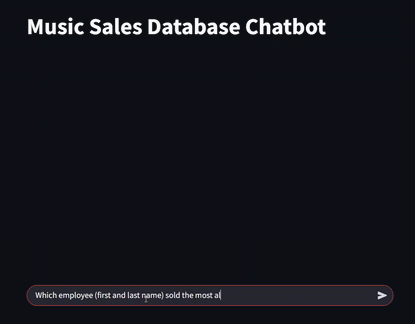

# SQL Chatbot Agent for Civil Engineering Data

This project provides a SQL chatbot agent designed to query and analyze civil engineering data. The agent leverages OpenAI, LangChain, and additional tools (like Google Search) to answer queries related to civil engineering construction projects.

Due to the sensitive data in question, this project has public facing and private data. For the public facing side of this project, I am showcasing a sample music database that can be queried. The chatbot converts natural language to SQL, and returns to the user the expected answer and the thinking + code that was used to arrive there.



This project is still evolving for the client in question.

## Sample Data

As mentioned above, the data for this project is secret and I've provided a sample database to pull from.

Queries such as the following show the power of this chatbot:
- How many customers purchased AC/DC albums?
- Which employee (first and last name) sold the most albums, and how many were sold?

### Data Sources
- Sample sqlite database provided from https://www.sqlitetutorial.net/sqlite-sample-database/


---

## Setup

### 1. Create a Python Virtual Environment

#### Windows
```bash
py -m venv venv
```

#### Mac/Linux
```bash
python3 -m venv venv
```

### 2. Activate the Virtual Environment

#### Windows
```bash
source venv/Scripts/activate
```

#### Mac/Linux
```bash
source venv/bin/activate
```

### 3. Install Required Packages
Run the `requirements.txt` file
```bash
pip install -r requirements.txt
```

### 4. Set Environment Variables
Create a `.env` file in your project root directory and add the following variables (replace placeholder values with your actual keys):

```.env
OPENAI_API_KEY=your_openai_api_key_here
SERPAPI_API_KEY=your_serpapi_api_key_here
```

- OPENAI_API_KEY: Your OpenAI API key.
- SERPAPI_API_KEY: API key for SerpAPI (if using for internet searches).

## Running the Application

### Start the virtual environment (if not already started):

#### Windows
```bash
source venv/Scripts/activate
```

#### Mac/Linux
```bash
source venv/bin/activate
```

### Start the app
After configuration, you can run the application using Streamlit:

```bash
streamlit run app.py
```

